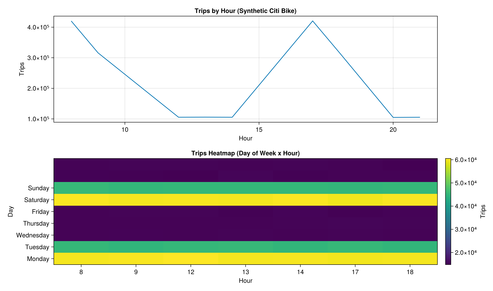
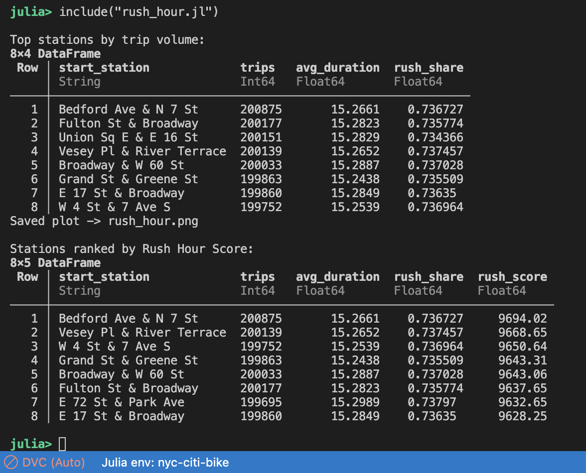

# NYC Citi Bike – Rush Hour Analysis

A minimal Julia project that simulates NYC Citi Bike–style trip data and visualizes rush-hour patterns using fast DataFrame analytics and high-quality Makie plots.

## Output
Below is the generated visualization showing hourly trip volume and a day-of-week × hour heatmap:

> *The line chart highlights commute peaks around 8–9 AM and 5–6 PM, while the heatmap shows how trip volume varies by hour across weekdays and weekends, with stronger, more evenly distributed activity on Saturdays and Sundays.*

## Terminal Output
The terminal output displays the first few rows of the simulated trip data:

